# UH2025-CDS-Agent Architecture

**Version**: 2.0.0
**Last Updated**: November 25, 2025

This document provides detailed technical architecture for the UH2025-CDS-Agent system.

---

## Overview

The UH2025-CDS-Agent implements a **4-agent + HITL (Human-in-the-Loop)** architecture designed for edge-native deployment on consumer hardware (M4 MacBook Pro).

---

## System Architecture Diagram

```mermaid
flowchart TB
    subgraph Input["📄 Input Layer"]
        CS[Clinical Summary<br/>Markdown/PDF]
        VCF[Genomic Variants<br/>VCF/JSON]
    end

    subgraph Agents["🤖 Agent Layer - Local Edge Compute"]
        subgraph Ingestion["1️⃣ Ingestion Agent"]
            IA[Llama 3.2 3B<br/>Q4_K_M]
            IA_OUT[Normalized<br/>Patient Context]
        end

        subgraph Structuring["2️⃣ Structuring Agent"]
            SA[Qwen 2.5 14B<br/>Q4_K_M]
            DT[Diagnostic Table]
            VT[Variants Table]
            TUP[Tool-Usage Plan]
        end

        subgraph Executor["3️⃣ Executor Agent"]
            EA[Python<br/>Sandboxed]
            subgraph BioTools["Bio-Tools Library"]
                CV[ClinVar]
                SP[SpliceAI]
                AM[AlphaMissense]
                RV[REVEL]
                OM[OMIM]
            end
            RO[Raw Outputs<br/>JSON]
        end

        subgraph Synthesis["4️⃣ Synthesis Agent"]
            SYN[Qwen 2.5 32B<br/>Q4_K_M]
            TUR[Tool Usage Report<br/>Markdown]
        end
    end

    subgraph HITL["👨‍⚕️ Human-in-the-Loop"]
        PR[Physician Review]
        FB[RLHF Feedback]
        GMW[Global Model<br/>Weights]
    end

    CS --> IA
    VCF --> IA
    IA --> IA_OUT
    IA_OUT --> SA
    SA --> DT
    SA --> VT
    SA --> TUP
    TUP --> EA
    VT --> EA
    EA --> CV
    EA --> SP
    EA --> AM
    EA --> RV
    EA --> OM
    CV --> RO
    SP --> RO
    AM --> RO
    RV --> RO
    OM --> RO
    RO --> SYN
    DT --> SYN
    VT --> SYN
    SYN --> TUR
    TUR --> PR
    PR --> FB
    FB --> GMW
```



---

## Agent Specifications

### 1. Ingestion Agent

**Purpose**: Parse and normalize clinical input data into a structured format.


**Model Configuration**:

```yaml
ingestion_agent:
  model:
    name: "llama-3.2-3b-instruct"
    backend: "llama.cpp"
    quantization: "Q4_K_M"
    context_length: 8192
    temperature: 0.1  # Low for deterministic extraction

  input_schema:
    clinical_summary: string  # Markdown or plain text
    genomic_data: object      # VCF-style JSON

  output_schema:
    patient_id: string
    demographics:
      age: integer
      sex: string
      ethnicity: string
    chief_complaint: string
    history_present_illness: string
    past_medical_history: list[string]
    family_history: string
    physical_exam: object
    variants: list[Variant]
```

**Why Llama 3.2 3B?**

- Fast inference (~100+ tokens/sec on M4)
- Excellent instruction following
- Strong at structured extraction
- Low memory footprint (~2GB)

---

### 2. Structuring Agent

**Purpose**: Generate diagnostic hypotheses and tool execution plan from patient context.


**Model Configuration**:

```yaml
structuring_agent:
  model:
    name: "qwen2.5-14b-instruct"
    backend: "llama.cpp"
    quantization: "Q4_K_M"
    context_length: 32768
    temperature: 0.3  # Moderate for reasoning

  output_schemas:
    diagnostic_table:
      - diagnosis: string
        omim_id: string
        confidence: float
        inheritance: string
        supporting_evidence: list[string]
        contradicting_evidence: list[string]

    variants_table:
      - gene: string
        variant: string
        protein_change: string
        zygosity: string
        pathogenicity_class: string
        priority: integer

    tool_usage_plan:
      - tool_name: string
        priority: string  # high | medium | low
        variants_to_query: list[string]
        expected_evidence: string
        timeout_seconds: integer
```

**Why Qwen 2.5 14B?**

- Strong multi-step reasoning
- Medical/scientific knowledge
- 32K context for full patient data
- Reliable structured output

---

### 3. Executor Agent

**Purpose**: Execute bio-tools in a sandboxed environment and collect results.


**Configuration**:

```yaml
executor_agent:
  # No LLM - pure Python orchestration
  model: null
  backend: "python"

  sandbox:
    enabled: true
    timeout_per_tool: 30  # seconds
    max_concurrent: 3
    network_allowed: true  # For API calls

  tools:
    clinvar:
      enabled: true
      api_key_env: "CLINVAR_API_KEY"
      rate_limit: 10  # requests/second

    spliceai:
      enabled: true
      database_path: "data/spliceai_scores.db"

    alphamissense:
      enabled: true
      database_path: "data/alphamissense.db"

    revel:
      enabled: true
      database_path: "data/revel_scores.db"

    omim:
      enabled: true
      api_key_env: "OMIM_API_KEY"
```

**Why No LLM?**

- Deterministic execution
- Security (no prompt injection)
- Speed (direct API calls)
- Auditability (logged calls)

---

### 4. Synthesis Agent

**Purpose**: Generate clinician-readable report from all collected evidence.


**Model Configuration**:

```yaml
synthesis_agent:
  model:
    name: "qwen2.5-32b-instruct"
    backend: "llama.cpp"
    quantization: "Q4_K_M"
    context_length: 32768
    temperature: 0.4  # Moderate for fluent writing

  report_sections:
    - executive_summary
    - primary_diagnosis
    - differential_diagnoses
    - variant_analysis
    - tool_results_summary
    - recommendations
    - limitations
    - references

  output_format: "markdown"
  include_confidence: true
  include_uncertainty: true
```

**Why Qwen 2.5 32B?**

- Highest quality prose generation
- Medical terminology fluency
- Appropriate uncertainty expression
- Comprehensive context integration

---

## Data Flow Diagram


---

## RLHF Integration Points

Expert feedback is collected at **every pipeline step**:


---

## Modular Configuration

Each agent supports hot-swappable components:

```yaml
# Example: Full agent configuration
agents:
  ingestion:
    model:
      provider: "llama.cpp"
      name: "llama-3.2-3b-instruct"
      path: "models/llama-3.2-3b-instruct.Q4_K_M.gguf"
    prompt:
      template: "prompts/ingestion_v1.yaml"
      system: "You are a clinical data extraction specialist..."
    context:
      few_shot_examples: "context/ingestion_examples.json"

  structuring:
    model:
      provider: "llama.cpp"
      name: "qwen2.5-14b-instruct"
      path: "models/qwen2.5-14b-instruct.Q4_K_M.gguf"
    prompt:
      template: "prompts/structuring_v1.yaml"
    context:
      disease_ontology: "context/hpo_omim.json"

  executor:
    tools:
      - clinvar
      - spliceai
      - alphamissense
      - revel
      - omim
    sandbox:
      enabled: true

  synthesis:
    model:
      provider: "llama.cpp"
      name: "qwen2.5-32b-instruct"
      path: "models/qwen2.5-32b-instruct.Q4_K_M.gguf"
    prompt:
      template: "prompts/synthesis_v1.yaml"
    report:
      format: "markdown"
      include_references: true
```

---

## Memory Budget (M4 MacBook Pro Max)

| Component | Memory | Notes |
|-----------|--------|-------|
| Ingestion Agent (3B) | ~2 GB | Can unload after use |
| Structuring Agent (14B) | ~10 GB | Primary reasoning |
| Executor Agent | <1 GB | Python only |
| Synthesis Agent (32B) | ~20 GB | Largest model |
| System + JupyterLab | ~4 GB | OS overhead |
| **Total Peak** | **~37 GB** | Sequential loading |

With sequential model loading, a 64GB M4 MacBook Pro can run the full pipeline with headroom for caching and tools.

---

## Security Considerations

### Data Privacy

- All inference runs locally (no cloud PHI exposure)
- Patient data never leaves the device
- Audit logging for compliance

### Sandboxing

- Executor Agent runs in restricted Python environment
- Network access limited to approved APIs
- No file system access outside designated directories

### Model Security

- Models loaded from verified sources
- Checksums validated before loading
- No fine-tuning during inference

---

## Extension Points

### Adding New Bio-Tools

1. Implement `BaseTool` interface
2. Register in `tool_registry.py`
3. Add to Structuring Agent's tool vocabulary
4. Document in `CONTRIBUTING.md`

### Adding New Agents

1. Extend `BaseAgent` class
2. Define input/output schemas
3. Create prompt template
4. Register in pipeline configuration

### Custom Prompts

1. Create YAML prompt template
2. Include system message, few-shot examples
3. Reference in agent configuration
4. Version control for reproducibility

---

## References

- [llama.cpp](https://github.com/ggerganov/llama.cpp) - Local LLM inference
- [Qwen2.5](https://qwenlm.github.io/) - Model family
- [Llama 3.2](https://ai.meta.com/llama/) - Meta's small models
- [Mermaid](https://mermaid.js.org/) - Diagram syntax
