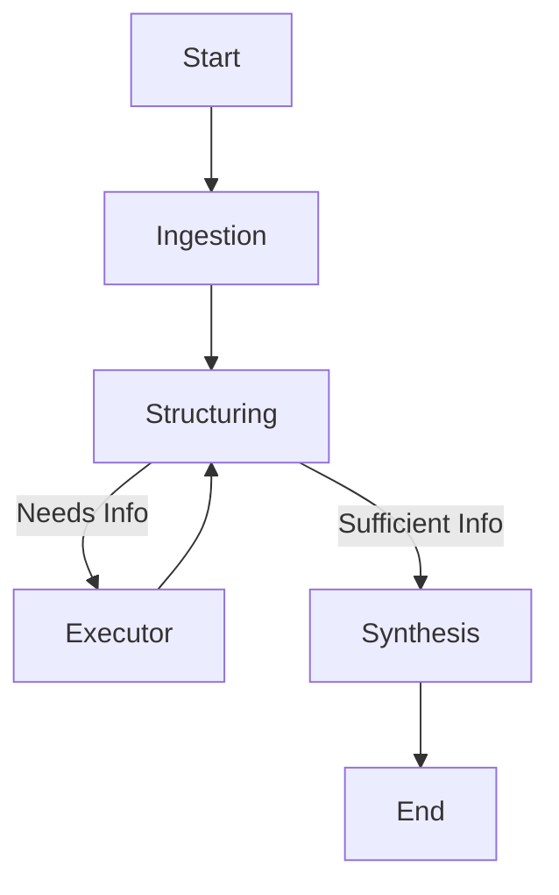

# Context Payload: Next Session (LangChain & Modularization)

## Objective
Migrate the `UH2025-CDS-Agent` from a manual Python skeleton to a robust **LangChain/LangGraph** application, while enforcing the **Lattice Federated Standard** and strict **HIPAA/Privacy** constraints.

## Key Resources
*   **Topology Root**: `lab/obs/topologies/UH2025Agent/`
*   **Module Template**: `lab/obs/modules/template/`
*   **Paper Directory**: `lab/obs/topologies/UH2025Agent/paper/`

## Plan of Action

### 1. LangChain Integration (The "Local-Only" Standard)
Refactor `code/agents/base_agent.py` to use LangChain, but with strict constraints to ensure zero data egress.

**HIPAA & Privacy Constraints:**
*   **No Cloud APIs**: Explicitly forbid `langchain_openai`, `langchain_anthropic`, etc.
*   **Local Backend Only**: MUST use `langchain_community.llms.LlamaCpp` or `ChatLlamaCpp`.
*   **Local Embeddings**: MUST use `HuggingFaceEmbeddings` (running on CPU/MPS).
*   **Tracing**: Disable default LangSmith tracing or ensure it points to a local Docker instance.
*   **Vector Store**: Use local `Chroma` or `FAISS` persistence (no Pinecone/Weaviate cloud).

**Target Architecture:**
```python
# ✅ HIPAA Safe (Local)
from langchain_community.llms import LlamaCpp
from langchain_core.prompts import PromptTemplate

# Load model directly from local disk (M4/Metal optimized)
llm = LlamaCpp(
    model_path="./models/qwen2.5-32b-instruct-q4_k_m.gguf",
    n_gpu_layers=-1,  # Use Metal
    n_ctx=8192,
    f16_kv=True,
    verbose=True
)

agent_chain = prompt | llm | parser
```

### 2. Module Standardization
Ensure `AlphaGenome`, `AlphaMissense`, and `RareLLM` follow the `lab/obs/modules/template` structure. 

**Task:**
For each module, ensure existence of:
- `notebooks/main.ipynb` (Papermill-ready)
- `AGENTS.md` (Context)
- `docker/Dockerfile` (Lattice L2 compatibility)

### 3. Orchestration Upgrade
Replace `PipelineExecutor` (Linear) with **LangGraph**.

**Why?**
The "Structuring Agent" needs to decide *which* tools to run, potentially looping back if results are ambiguous. A linear list cannot do this.

**Proposed Graph:**


### 4. Documentation & Context Updates
Update all `README.md` and `AGENTS.md` files to reflect the "Federated Context Engineering" philosophy.

**Key Narrative Points:**
*   **The Hackathon Model**: Reference the **Wilhelm Foundation** and **Rare Care Centre** hackathons as the "Genesis Event" for this technology.
*   **Context Engineering**: Define the role of the hackathon not just as "solving cases" but as "generating context" (prompts, logic) that improves the agents.
*   **Decentralized Experts**: Describe how networks of clinicians and data scientists contribute to the "Global Brain" without sharing patient data.

## Paper Context Integration
The `lab/obs/topologies/UH2025Agent/paper/` directory must be treated as a living part of the codebase.
*   **Content as Code**: Paper sections are markdown files.
*   **provenance**: Every claim in the paper should link back to a module or log in the repo.
