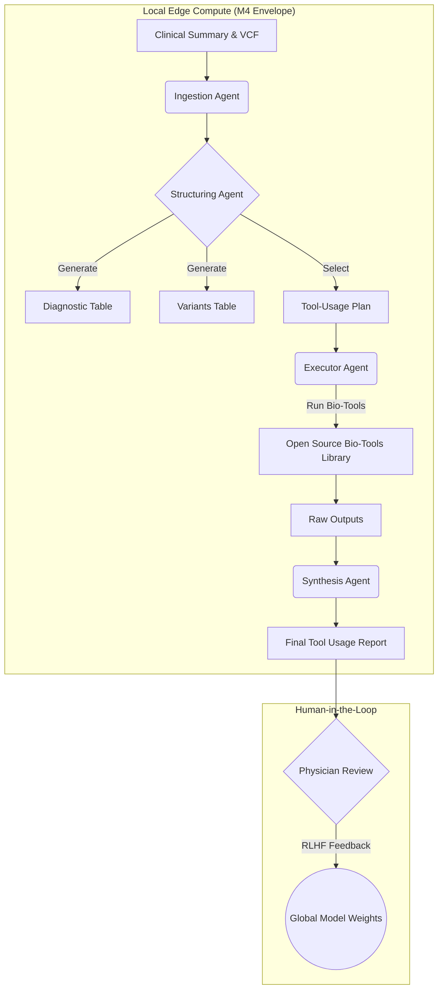

# RFC: AI-Driven Diagnostic Democratization

## Expanding the Undiagnosed Patient Hackathon Model

**Project**: Federated "Edge-Native" Diagnostic Agents for Undiagnosed Diseases
**Timeline**: November 2025 – March 2026
**Status**: Request for Comment (RFC) / Collaborative Draft
**Version**: 1.0.0

---

## 1. Executive Summary: The Democracy of Medical Data

The Mayo Clinic Undiagnosed Patient Hackathon has proven that breaking down silos—placing a clinician, a geneticist, and a data scientist in the same room—can solve cases that have stalled for years.

This proposal outlines a humbly scoped yet technically ambitious exploration: to scale this collaborative intelligence using open-source AI agents. We are not seeking to replace the physician. Instead, we aim to empower them with a "Democracy of Medical Data," ensuring that the sophisticated tooling usually reserved for elite research hospitals is accessible to on-the-ground clinicians anywhere in the world.

We propose a collaborative research sprint (November 2025 – March 2026) to build "Edge-Native" diagnostic agents. These systems will run locally on accessible hardware, ensuring privacy and availability, while being trained and tuned by a global consortium of experts.

---

## 2. Core Philosophy: Supportive, Not Replacive

The central tenet of this architecture is that AI is a supportive colleague, not a replacement.

### The "Humbly Scoped" Approach

We reject "black box" oracles. Our agents function as tireless research assistants—organizing data, running bio-tools, and structuring evidence—so that the human expert can focus on high-level reasoning.

### Human-in-the-Loop (HITL)

Every critical juncture in the workflow requires physician review. The goal is to elevate the clinician to their highest potential, providing them with a synthesized "Tool Usage Report" rather than a raw probability score.

---

## 3. Technical Architecture: The "Edge" Compute Envelope

A critical barrier to global health equity is the reliance on massive, centralized cloud compute, which introduces latency, cost, and privacy risks. We propose a radical shift toward Edge-Native AI.

### 3.1 The Deployment Standard: M4 MacBook Pro Max

We are standardizing our deployment envelope around high-end consumer hardware, specifically the M4 MacBook Pro Max.

**Why this matters**:

- By optimizing for this specific "edge" envelope, we ensure that a hospital in a resource-constrained setting can deploy the exact same powerful diagnostic tools as a top-tier academic center, without needing a million-dollar data center or high-bandwidth cloud connection.

**Privacy First**: Inference runs 100% locally. Patient genomic data never leaves the secure hospital environment.

**Accessibility**: This hardware is readily available globally. If it runs on the "standard" M4 rig, it works everywhere.

### 3.2 The "Diagnostic Arena" & RLHF

While inference is local, training is global. We introduce the "Diagnostic Arena":

**Synthetic Patient Challenges**: Agents will compete to diagnose synthetic patient profiles generated from historical hackathon data.

**RLHF (Reinforcement Learning from Human Feedback)**: When the agent proposes a tool or a diagnosis, human experts (clinicians, geneticists) "vote" on the reasoning. This feedback loop tunes the model.

**Citizen Science**: We frame this as a citizen science initiative. A geneticist in Tokyo can log in for 15 minutes, review three agent decisions, and contribute to the global "weights" of the model—capturing the "wisdom of the crowd" to improve local agents everywhere.

---

## 4. Methods: The Agentic Workflow

We define a modular Agentic Flow that strictly mirrors the operational process of a hackathon team. This is not a single LLM chat; it is a system of specialized agents working in concert.

### 4.1 The Workflow Stages

1. **Ingestion**: The Ingestion Agent reads the raw Clinical Summary (PDF notes, EHR export).

2. **Structuring**: The agent converts unstructured text into structured artifacts:
   - **Diagnostic Table**: Potential phenotypes and symptoms.
   - **Variants-of-Interest Table**: Genomic markers flagged for review.
   - **Tool-Usage Table**: A precise plan identifying which open-source bio-tools (e.g., variant callers, phenotype matchers) should be run on which data files.

3. **Execution**: A secondary Executor Agent (sandboxed) runs the selected tools using the parameters defined in step 2.

4. **Synthesis**: The Reporting Agent aggregates tool outputs into a readable Tool Usage Report for the human expert.

### 4.2 Visualization (Mermaid.js)

Below is the logic flow for the proposed architecture:



### 4.3 Modularity via GitHub

The system is designed to be extensible. A bioinformatics PhD student can contribute a new "Tool Definition" (e.g., a new splice-variant predictor) via a GitHub Pull Request. Once vetted, this tool becomes available to the Structuring Agent to select in future cases.

---

## 5. The Consortium & Community

This project unites organizations at the frontier of rare disease diagnosis:

- **Rare Care Centre Network & Mayo Clinic**: Clinical validation and hackathon framework.
- **Rare Molecule Foundry & DeepMind**: Open-source ML systems and technical expertise.
- **Wilhelm Foundation**: Patient advocacy and alignment.
- **Stanford Medicine & CZI**: Technology expertise and computational resources.

### Call to Action: Join the "Citizen Science" Layer

We are building this in the open on the Wilhelm Foundation GitHub.

**How to Contribute**:

| Level | Contribution | Recognition |
|-------|--------------|-------------|
| **Heavy** | Write code for new bio-tool wrappers | Co-authorship on methodology paper |
| **Medium** | Participate in "Diagnostic Arena" reviews to tune the model | Acknowledgment in publications |
| **Light** | Join our monthly review calls or comment on the architecture RFC | Community recognition |

Even "mild" participation (e.g., attending review calls, providing RLHF feedback) will be credited in the final methodology paper.

**Target Publications**: NeurIPS / Nature Medicine

---

## 6. Roadmap (Nov 2025 – March 2026)

### Phase 1: Mapping (November)

- Map the full hackathon workflow
- Define the "M4 Envelope" constraints
- Establish agent architecture

### Phase 2: The Arena (December - January)

- Launch the "Diagnostic Arena" for RLHF data collection using synthetic patients
- Begin collecting expert feedback
- Iterate on agent prompts and configurations

### Phase 3: Execution (February)

- Integrate the Executor Agent with the first set of 5 key bio-tools:
  - ClinVar
  - SpliceAI
  - AlphaMissense
  - REVEL
  - OMIM
- Validate end-to-end pipeline execution

### Phase 4: Validation (March)

- Run the agent alongside human teams in a "Shadow Hackathon"
- Measure utility, safety, and hallucination rates
- Prepare methodology publication

---

## 7. Conclusion

We are not just building software; we are encoding a culture of collaboration. By capturing the process of the world's best diagnostic teams and optimizing it for accessible local hardware, we can bring the "hackathon effect" to any clinic, anywhere, anytime.

This is a humbly scoped step toward a future where no patient is left undiagnosed due to a lack of compute or expertise—and where the global medical community can collectively improve diagnostic AI through federated, privacy-preserving collaboration.

---

## Appendix A: Technical Specifications

### A.1 Model Configuration

| Agent | Model | Quantization | Memory | Context |
|-------|-------|--------------|--------|---------|
| Ingestion | Llama 3.2 3B | Q4_K_M | ~2GB | 8K |
| Structuring | Qwen 2.5 14B | Q4_K_M | ~10GB | 32K |
| Executor | Python (no LLM) | N/A | <1GB | N/A |
| Synthesis | Qwen 2.5 32B | Q4_K_M | ~20GB | 32K |

### A.2 Bio-Tools Library

| Tool | Function | Data Source | Priority |
|------|----------|-------------|----------|
| ClinVar | Clinical significance | NCBI API | P0 |
| SpliceAI | Splice prediction | Illumina | P0 |
| AlphaMissense | Pathogenicity | DeepMind | P0 |
| REVEL | Ensemble scores | dbNSFP | P0 |
| OMIM | Disease-gene links | OMIM API | P0 |

### A.3 RLHF Feedback Schema

```yaml
feedback:
  step_id: string          # Which agent step
  timestamp: datetime
  reviewer:
    id: string
    role: enum[clinician, geneticist, data_scientist]
  assessment:
    correctness: enum[correct, partial, incorrect]
    confidence: float[0-1]
  corrections:
    - field: string
      original: any
      corrected: any
      rationale: string
  notes: string
  time_spent_seconds: integer
```

---

## Appendix B: References

1. Mayo Clinic Undiagnosed Diseases Program
2. Cheng et al. (2023). AlphaMissense. *Science*, 381(6664)
3. Jaganathan et al. (2019). SpliceAI. *Cell*, 176(3)
4. ACMG Guidelines for Variant Interpretation
5. Human Phenotype Ontology (HPO)

---

## Document History

| Version | Date | Author | Changes |
|---------|------|--------|---------|
| 1.0.0 | 2025-11-25 | Wilhelm Foundation | Initial RFC |

---

## Feedback

To provide feedback on this RFC:

1. Open an issue on the GitHub repository
2. Join the monthly consortium review call
3. Email: rfc@wilhelm-foundation.org (placeholder)

**Deadline for comments**: January 15, 2026
