# Context Payload: Section 01

This payload is designed for injection into the Presentation Context or for use by generative agents to create slides, diagrams, and summaries.

## 1. Section Metadata
*   **ID**: 01_introduction
*   **Title**: The Global Burden & The UH2025 Vision
*   **Source Files**: `diagnostic_odyssey.md`, `economic_burden.md`

## 2. Generative Prompt
> **Role**: Scientific Communicator
> **Task**: Explain the "Diagnostic Odyssey" and the "UH2025 Vision" to a mixed audience of clinicians and technologists.
> **Key Points**:
> - The Paradox: Rare diseases are individually rare but collectively massive (350M people).
> - The Problem: Centralized AI puts privacy at risk and limits access.
> - The Vision: Collaborative, on-prem agentic systems can replicate "Hackathon Magic" without data egress.

## 3. Mermaid Diagram Logic

```mermaid
graph TD
    Clinicians[("🩺 Clinical Expertise")]
    Devs[("💻 Technical Innovation")]
    Patients[("❤️ Patient Needs")]

    Core((("🚀 UH2025 Agentic CDS\n(The Solution)")))

    Clinicians -->|Domain Knowledge| Core
    Devs -->|Agent Architecture| Core
    Patients -->|Data & Urgency| Core

    style Clinicians fill:#aed6f1,stroke:#3498db
    style Devs fill:#abebc6,stroke:#2ecc71
    style Patients fill:#f9e79f,stroke:#f1c40f
    style Core fill:#fff,stroke:#8e44ad,stroke-width:4px
```

## 4. Key Pull-Quotes
*   "If the global population of individuals with rare diseases were a single nation, it would be the third-largest country on Earth."
*   "The 'diagnostic gap' is not merely a failure of technology but a failure of the current centralized model."

