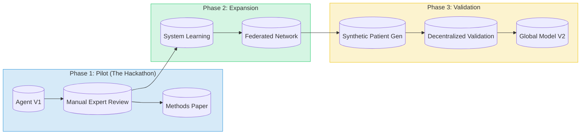

# Context Payload: Section 02

This payload is designed for injection into the Presentation Context or for use by generative agents to create slides, diagrams, and summaries.

## 1. Section Metadata
*   **ID**: 02_hackathon
*   **Title**: The Undiagnosed Hackathon & Swarm Dynamics
*   **Source Files**: `methodology.md`, `swarm_dynamics.md`

## 2. Generative Prompt
> **Role**: Scientific Historian
> **Task**: Describe the "Undiagnosed Hackathon" as the manual prototype for the UH2025 Agent.
> **Key Points**:
> - Origin: Wilhelm Foundation's mission to solve the unsolvable.
> - Method: "Extreme Collaboration" where tool-makers (Illumina, Nanopore) sit with tool-users (Clinicians).
> - Outcome: 4 diagnoses in 48 hours (Stockholm pilot) - proof that data integration works.

## 3. Mermaid Diagram Logic

## 4. Key Pull-Quotes
*   "Unlike traditional hackathons that focus on software development, this event is a high-intensity medical investigation."
*   "Each time the bell rang, scientists cheered... symbolizing the end of years of uncertainty."

