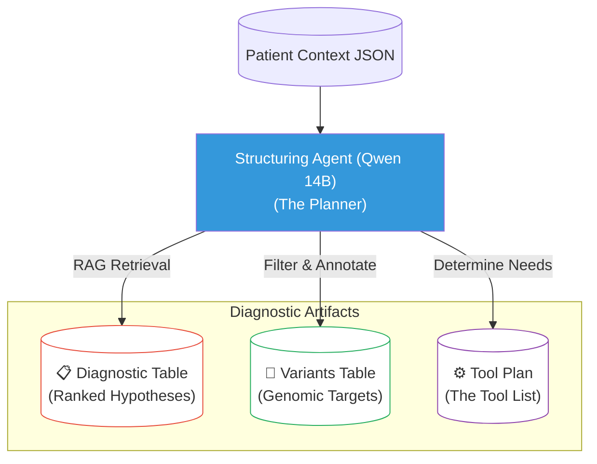

# Context Payload: Section 03

This payload is designed for injection into the Presentation Context or for use by generative agents to create slides, diagrams, and summaries.

## 1. Section Metadata
*   **ID**: 03_workflow
*   **Title**: The Planner-Executor Cognitive Model
*   **Source Files**: `planner_executor.md`, `tool_list.md`

## 2. Generative Prompt
> **Role**: Cognitive Scientist
> **Task**: Explain the "Planner-Executor" dynamic in clinical diagnostics.
> **Key Points**:
> - Humans split the task: Senior Clinician (Strategy) vs. Bioinformatician (Tactics).
> - The Bottleneck: Human communication latency (emails, meetings) slows the loop.
> - The Agentic Solution: Integrating both roles into a single loop reduces latency from days to seconds.

## 3. Mermaid Diagram Logic

## 4. Key Pull-Quotes
*   "The 'Tool List' generated by the clinicians is the critical artifact... It represents the logic of diagnosis."
*   "An 'agentic' workflow reasons about the data and adapts the path accordingly, unlike a static pipeline."

