# Context Payload: Section 04

This payload is designed for injection into the Presentation Context or for use by generative agents to create slides, diagrams, and summaries.

## 1. Section Metadata
*   **ID**: 04_multiomics
*   **Title**: Beyond the Exome: The Multi-Omics Frontier
*   **Source Files**: `beyond_exome.md`, `data_integration.md`

## 2. Generative Prompt
> **Role**: Genomic Data Scientist
> **Task**: Explain why standard genetic testing fails 60% of patients.
> **Key Points**:
> - Standard of Care: Short-read WES looks at 1-2% of the genome.
> - The Missing Answers: Deep intronic variants, repeat expansions, and methylation anomalies are invisible to WES.
> - The Tech Stack: Long-read sequencing (Nanopore) + Transcriptomics (RNA) + Methylation = The Full Picture.

## 3. Mermaid Diagram Logic

```mermaid
graph LR
    subgraph Layers["The Multi-Omics Stack"]
        DNA[("🧬 DNA Sequence\n(WGS)")]
        RNA[("📝 RNA Expression\n(Transcriptomics)")]
        Meth[("🔖 Methylation\n(Epigenetics)")]
    end

    subgraph Insight["Diagnostic Yield"]
        WES["Standard WES\n(30-40%)"]
        Multi["Multi-Omics\n(>60%)"]
    end

    DNA --> WES
    DNA --> Multi
    RNA --> Multi
    Meth --> Multi

    style Layers fill:#e8f8f5,stroke:#1abc9c
    style Insight fill:#fcf3cf,stroke:#f1c40f
```

## 4. Key Pull-Quotes
*   "The transition from WES to comprehensive multi-omics is essential for solving the remaining 60% of undiagnosed cases."
*   "A variant might look benign in the DNA sequence, but RNA-seq can show that it causes exon skipping."

