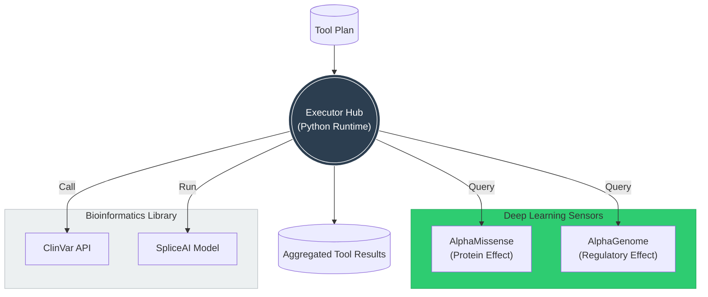

# Context Payload: Section 05

This payload is designed for injection into the Presentation Context or for use by generative agents to create slides, diagrams, and summaries.

## 1. Section Metadata
*   **ID**: 05_agentic_ai
*   **Title**: The Agentic Architecture: Planner, Executor, Evaluator
*   **Source Files**: `architecture.md`, `biotools_registry.md`

## 2. Generative Prompt
> **Role**: AI Architect
> **Task**: Explain the technical architecture of the UH2025 Agent.
> **Key Points**:
> - The Pipeline: Four agents (Ingestion, Structuring, Executor, Synthesis) coordinated by a state machine.
> - The Brain: LLMs (Llama 3, Qwen 2.5) provide reasoning and planning.
> - The Senses: Deep Learning models (AlphaMissense, AlphaGenome) provide high-precision data.

## 3. Mermaid Diagram Logic

## 4. Key Pull-Quotes
*   "An AI agent is not just a script; it is a software system capable of perception, reasoning, and autonomous action."
*   "AlphaMissense serves as a high-precision 'sensor' for the Agentic Planner, providing confident data points in the vast search space."

