# Context Payload: Section 06

This payload is designed for injection into the Presentation Context or for use by generative agents to create slides, diagrams, and summaries.

## 1. Section Metadata
*   **ID**: 06_federation
*   **Title**: The Rare Arena Network: Federated Learning
*   **Source Files**: `privacy_utility.md`, `swarm_learning.md`

## 2. Generative Prompt
> **Role**: Network Architect
> **Task**: Explain the Federated Learning infrastructure of the Rare Arena Network.
> **Key Points**:
> - The Dilemma: We need global data to solve rare diseases, but privacy laws prevent sharing it.
> - The Solution: Federated Learning sends the AI model to the hospital, trains it locally, and sends back only the "lesson" (gradient weights).
> - The Protection: Differential Privacy ensures that the "lesson" cannot be traced back to any specific patient.

## 3. Mermaid Diagram Logic

```mermaid
graph TD
    Central[("Aggregation Server\n(Global Weights)")]

    subgraph Node_A["🏥 Hospital Node A"]
        Local_A[("Local Model")]
    end

    subgraph Node_B["🏥 Hospital Node B"]
        Local_B[("Local Model")]
    end

    subgraph Node_C["🏥 Hospital Node C"]
        Local_C[("Local Model")]
    end

    Local_A <-->|Weight Updates| Central
    Local_B <-->|Weight Updates| Central
    Local_C <-->|Weight Updates| Central

    Node_A -.-x|No Patient Data| Node_B
    Node_B -.-x|No Patient Data| Node_C

    style Central fill:#d35400,stroke:#e67e22,color:#fff
```

## 4. Key Pull-Quotes
*   "We need global data to solve rare diseases, but we cannot move the data."
*   "Federated Learning offers the solution: 'Bring the code to the data, not the data to the code'."

