# Context Payload: Section 07

This payload is designed for injection into the Presentation Context or for use by generative agents to create slides, diagrams, and summaries.

## 1. Section Metadata
*   **ID**: 07_rlhf
*   **Title**: The Doctor-in-the-Loop: RLHF & The Alignment Paradox
*   **Source Files**: `doctor_in_loop.md`, `ui_implementation.md`

## 2. Generative Prompt
> **Role**: UX/AI Researcher
> **Task**: Explain the "Doctor-in-the-Loop" RLHF mechanism.
> **Key Points**:
> - The Challenge: Medical AI faces an "Alignment Paradox" where accurate models are rejected for opaque reasoning.
> - The Solution: An interactive "Arena" interface where doctors critique ("roast") the AI's logic.
> - The Outcome: The model learns *how* a doctor thinks, not just the final diagnosis.

## 3. Mermaid Diagram Logic

```mermaid
graph LR
    User((("👤 User / Expert")))

    subgraph Interface["Arena Interface"]
        Config["1. Configuration\n(Prompts/Models)"]
        Evaluator["2. Evaluator Agent\n(Quality Control)"]
        Display["3. Output Display"]
        Input["4. Feedback Entry"]
    end

    subgraph Backend["Data Collection"]
        Logs[("Performance Logs")]
        Training[("Training Dataset")]
    end

    User -->|Selects| Config
    Config -->|Runs| Evaluator
    Evaluator -->|Validates| Display
    Display -->|Reviews| User
    User -->|Submits| Input
    Input -->|Captures| Logs
    Logs -->|Aggregates| Training
    Training -.->|Improves| Config

    style Interface fill:#f4ecf7,stroke:#9b59b6
    style Backend fill:#e8f6f3,stroke:#16a085
    style Evaluator fill:#e67e22,stroke:#d35400,color:#fff
```

## 4. Key Pull-Quotes
*   "As they critique the models... they are effectively transferring their intuition and expertise into the AI's neural network."
*   "This process captures the tacit knowledge of the world's best diagnosticians."

