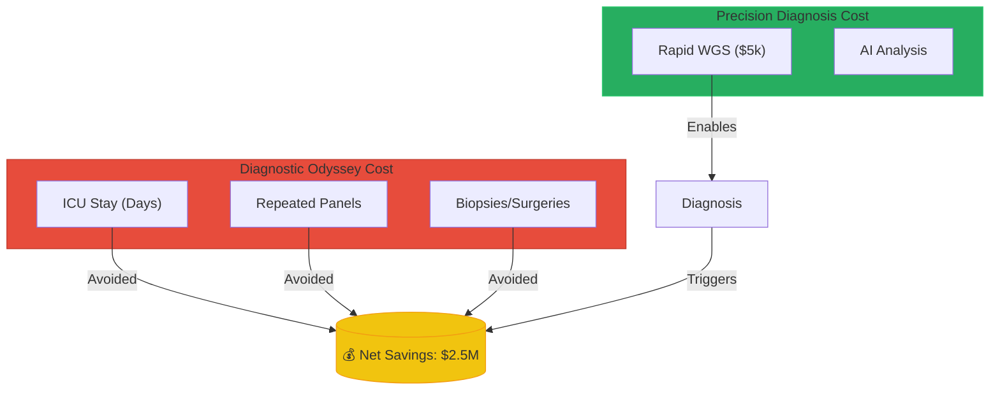

# Context Payload: Section 08

This payload is designed for injection into the Presentation Context or for use by generative agents to create slides, diagrams, and summaries.

## 1. Section Metadata
*   **ID**: 08_validation
*   **Title**: Validation: Clinical & Economic Impact
*   **Source Files**: `case_studies.md`, `baby_bear.md`

## 2. Generative Prompt
> **Role**: Health Economist / Clinical Researcher
> **Task**: Validate the "Rare Arena" model using historical data.
> **Key Points**:
> - Clinical Proof: The Hackathon solved "cold cases" by using the exact multi-omics tools we are automating (e.g., DNA2 deep intronic variant).
> - Economic Proof: Project Baby Bear proved that rapid WGS saves $2.5M for every 180 infants.
> - Conclusion: Precision diagnosis is cheaper than the "Diagnostic Odyssey."

## 3. Mermaid Diagram Logic

## 4. Key Pull-Quotes
*   "Rapid diagnosis led to changes in clinical management for 65% of the diagnosed infants."
*   "The cost of the sequencing... was far outweighed by the savings ($2.2–2.9 million)."

