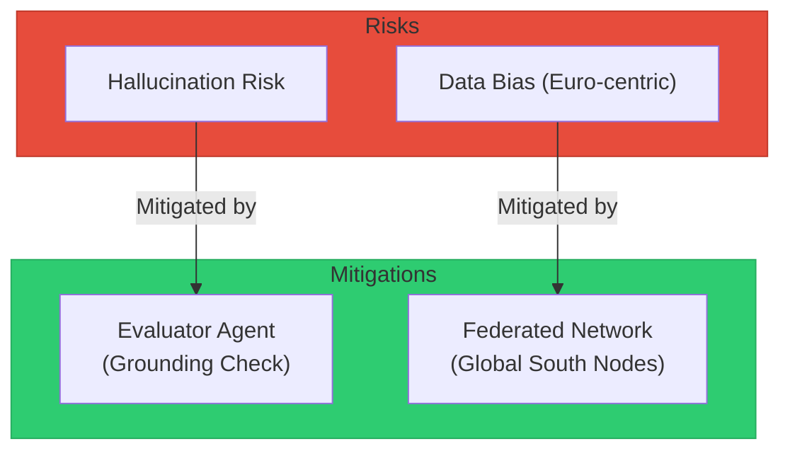

# Context Payload: Section 09

This payload is designed for injection into the Presentation Context or for use by generative agents to create slides, diagrams, and summaries.

## 1. Section Metadata
*   **ID**: 09_ethics
*   **Title**: Ethics: Hallucination, Bias, and Equity
*   **Source Files**: `challenges.md`

## 2. Generative Prompt
> **Role**: Bioethicist
> **Task**: Address the ethical challenges of AI in rare disease diagnosis.
> **Key Points**:
> - Hallucination: A real risk. Mitigation = Grounding + Evaluator Agent.
> - Bias: Genomic data is too white. Solution = Federated Learning with diverse global nodes.
> - Equity: Federation allows developing nations to contribute data without losing sovereignty ("Data Colonialism").

## 3. Mermaid Diagram Logic

## 4. Key Pull-Quotes
*   "Strict 'grounding' mechanisms are required, where the AI must cite its sources before a recommendation is accepted."
*   "Federating the learning... respects data sovereignty while improving global equity."

