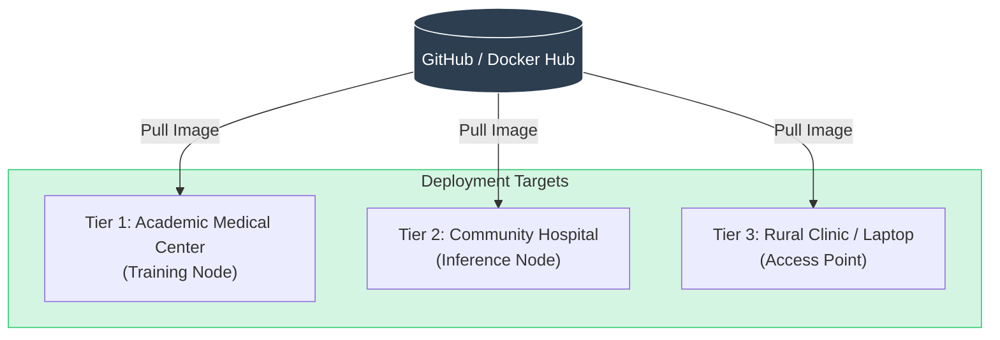

# Context Payload: Section 10

This payload is designed for injection into the Presentation Context or for use by generative agents to create slides, diagrams, and summaries.

## 1. Section Metadata
*   **ID**: 10_future
*   **Title**: Future Outlook: Democratized Access & Scalability
*   **Source Files**: `outlook.md`

## 2. Generative Prompt
> **Role**: Medical Futurist
> **Task**: Describe the future of the Rare Arena Network.
> **Key Points**:
> - Scalability: Code that runs on a laptop (L1) can scale to a datacenter (L3).
> - Automation: "Always-on" re-analysis means no case is ever closed until solved.
> - Vision: The end of the "Diagnostic Odyssey" through distributed, agentic intelligence.

## 3. Mermaid Diagram Logic

## 4. Key Pull-Quotes
*   "The technology is no longer the bottleneck; the tools exist. The challenge now is integration."
*   "We envision a future where diagnosis is autonomous... ensuring that no case is ever truly 'closed' until solved."

