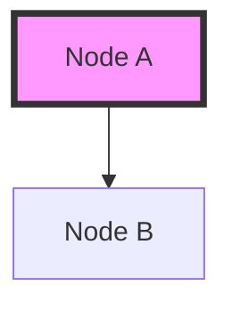

# Context Payload: Section [SECTION_NUMBER]

This payload is designed for injection into the Presentation Context or for use by generative agents to create slides, diagrams, and summaries.

## 1. Section Metadata
*   **ID**: [SECTION_ID]
*   **Title**: [SECTION_TITLE]
*   **Source Files**: `[LIST_FILES]`

## 2. Generative Prompt
> **Role**: Scientific Communicator
> **Task**: Explain [TOPIC] to [AUDIENCE].
> **Key Points**:
> - Point 1
> - Point 2
> - Point 3

## 3. Mermaid Diagram Logic

## 4. Key Pull-Quotes
*   "Quote 1"
*   "Quote 2"

